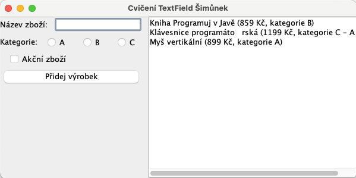

# Cvičení: Textová pole, checkbox, radio-button

## Zadání

Vytvořte aplikaci s&nbsp;grafickým uživatelským rozhraním, která bude splňovat následující požadavky:
- Aplikace bude mít (jednořádková) textová pole pro zadání názvu výrobku a dvě (jednořádková) textová pole pro zadání ceny výrobku a kroku zvyšování ceny.
- Přidejte tlačítka s popisem „+“ a „-“, které zvýší či sníží hodnotu v poli cena o krok, zadaný v&nbsp;druhém textovém poli.
- Přidejte zatrhávací tlačítko s popisem „Akční zboží“ a přepínací tlačítka „Kategorie: A/B/C“ (vždy bude aktivní právě jedno přepínací tlačítko).
- Přidejte tlačítko pro resetování obsahu formuláře – vymaže obsah všech textových polí, zruší zatržení „Akční zboží“ a zvolí přepínací tlačítko „A“.
- Přidejte víceřádkové textové pole pro uložení předchozích zadaných výrobků a tlačítko pro uložení dat z formuláře do víceřádkového textového pole „Výstup“. Při stisknutí tlačítka se údaje o výrobku z ostatních polí přidají na nový řádek do pole „Výstup“ ve formátu:
```
název výrobku (cena Kč, kategorie A - Akce!)
```
(Pokud se jedná o akční zboží, bude uveden text „Akce!“. V&nbsp;opačném případě text uveden nebude.)

Například:
```
Kniha Programuj v Javě (859 Kč, kategorie B)
Klávesnice programátorská (1199 Kč, kategorie C – Akce!)
Myš vertikální (899 Kč, kategorie A)
```

## Vzhled aplikace


